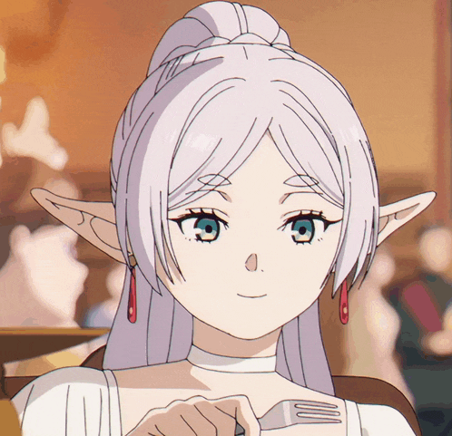

<h1 align="left">✨Hey there, I’m Mostafa Sensei106!</h1>

<h3 align="left">📱 Mobile App Software Engineer [Kotlin - Flutter] | 🌐 Back-End | 🎨 Artist</h3>

  
    
  
    
  
    

- 🔭 Software Engineer specializing in mobile application development
- 📚 Currently enhancing my Japanese language skills and advancing software engineering expertise
- 🎯 Career Goal: To become a leading mobile application engineer in Japan
- 🚀 Focused on building innovative applications that push the boundaries of technology and design
- 🌱 Continuously learning and developing new skills

## Technical Skills

  
  
  
  
  
  
  
  
  
  
  
  
  
  
  

## GitHub Analytics

  
  

## Contribution Activity

  

<picture>
  <source media="(prefers-color-scheme: dark)" srcset="https://raw.githubusercontent.com/MostafaSensei106/MostafaSensei106/output/pacman-contribution-graph-dark.svg">
  <source media="(prefers-color-scheme: light)" srcset="https://raw.githubusercontent.com/MostafaSensei106/MostafaSensei106/output/pacman-contribution-graph.svg">
  
</picture>

## Support My Work

  

